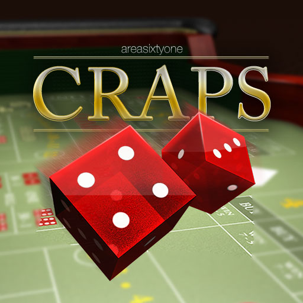

# 🎲 Digital Dice Game – Craps

**Final Project – Digital Design**  
Bu-Ali Sina University, Computer Engineering Department (BASU)



---

## Table of Contents

- [Overview](#-overview)
- [Game Rules](#-game-rules-craps--hardware-version)
- [Project Structure](#-project-structure)
- [Architecture](#-architecture)
- [Prerequisites](#-prerequisites)
- [Build & Simulation](#-build--simulation)
- [Collaborators](#-collaborators)
- [License & Academic Context](#-license--academic-context)
- [Acknowledgments](#-acknowledgments)
-
---

## ✨ Overview

This repository contains a **complete hardware implementation** of the classic **Craps** dice game, developed as the **digital logic design final project**. The system is implemented entirely in **VHDL** and is suitable for FPGA or simulation (e.g. GHDL).

The design follows the specification from the project document **“DESIGN OF A DICE GAME – Digital Logic Design Project | Bu-Ali Sina – 4041”** and emphasizes:


- **FSM-based control** of the game flow  
- **Clear separation** between datapath, controller, and display logic  
- **Testbenches** for components and the full system  

Main building blocks:

- Two **pseudo-random dice counters**
- **Adder** and **comparator** for game rules  
- **Point register** to store the established point  
- **Controller FSM** (Moore-type) for game states and outputs  
- **7-segment decoders** and display gating so only “final” results are shown when appropriate  

---

## 🎮 Game Rules (Craps – Hardware Version)

The system simulates rolling **two six-sided dice** and evaluates the **sum (2–12)** as follows.

### First roll (Come-out roll)

| Sum    | Result              |
|--------|---------------------|
| 7 or 11 | **Win** 🎉         |
| 2, 3, 12 | **Lose** 💀        |
| 4, 5, 6, 8, 9, 10 | **Point** – value stored for the next phase |

### Subsequent rolls (Point phase)

| Condition        | Result        |
|------------------|---------------|
| Sum = stored point | **Win** 🎯   |
| Sum = 7          | **Lose** 💥   |
| Otherwise        | Roll again 🔁 |

### User interface

- **Reset** (active high): starts a new game and clears all state.  
- **Roll** (active high):  
  - **Pressed and held** → dice counters run (values change).  
  - **Released** → current dice values are captured and evaluated; win/lose/point is decided on the next clock edge.  

### Outputs

- **Two 7-segment displays**: one per die (values 1–6). They are **gated** so that numbers are shown only in specific FSM states (e.g. after evaluation, win, lose, or during reset), not while the dice are “rolling”.  
- **Two LEDs**: **Win** and **Lose**, driven by the controller FSM.  

---

## 📁 Project Structure

```
vhdl_dice_project/
├── README.md                 # This file
├── run_sim.sh                # GHDL compile + run
├── moduels/                  # VHDL source (note: directory name "moduels")
│   ├── adder.vhd             # 3-bit + 3-bit → 4-bit sum
│   ├── comparator.vhd        # 4-bit equality (sum vs point)
│   ├── dice_counter.vhd      #1–6 counter (one die)
│   ├── register.vhd          # point_register (store point on Sp=1)
│   ├── test_logic.vhd        # D7, D711, D2312 from sum
│   ├── seven_seg2.vhd        # 7-segment decoder
│   ├── controller_fsm.vhd     # Moore FSM: Roll, Sp, Win, Lose, Show
│   └── craps_system.vhd      # Top-level: wires all blocks + display gating
├── testbenches/
│   ├── tb_adder.vhd
│   ├── tb_comparator.vhd
│   ├── tb_dice_counter.vhd
│   ├── tb_register.vhd
│   ├── tb_test_logic.vhd
│   ├── tb_seven_seg2.vhd
│   ├── tb_controller_fsm.vhd
│   └── tb_craps_system.vhd   # Full system testbench
├── work/                     # Generated by run_sim.sh (compile + VCD)
│   └── tb_craps_system.vcd   # Waveform (open with gtkwave)
└── pic/
    └── unnamed.jpg           # Project image
```

---

## 🏗 Architecture

### Top-level (`craps_system`)

- **Inputs**: `clk`, `reset_btn`, `roll_btn`  
- **Outputs**: `seg_die1`, `seg_die2` (7-bit each), `win_led`, `lose_led`  

The top-level instantiates:

1. **Two `dice_counter`** instances (die1, die2) – optionally with different clock/enable patterns for more varied rolls.  
2. **Adder** – sum of the two 3-bit die values → 4-bit sum (2–12).  
3. **`point_register`** – stores the point when the FSM asserts `Sp` for one cycle.  
4. **Comparator** – asserts `Eq` when sum equals stored point.  
5. **`test_logic`** – combinational: `D7` (sum=7), `D711` (7 or 11), `D2312` (2, 3, or 12).  
6. **`controller_fsm`** – Moore FSM; outputs: `Roll`, `Sp`, `Win`, `Lose`, and **`Show`** (used to gate the 7-segment displays).  
7. **Two `seven_seg`** decoders – drive internal segment signals; outputs are gated by `Show`.  

### Controller FSM (Moore)

States: `reset_state`, `roll_come_out`, `eval_come_out`, `store_point`, `idle_point`, `roll_point`, `eval_point`, `win_state`, `lose_state`.

- **Roll**: asserted only in `roll_come_out` and `roll_point` (dice run while button is held).  
- **Sp**: one-cycle pulse in `store_point`.  
- **Win / Lose**: asserted in `win_state` / `lose_state`.  
- **Show**: asserted in `reset_state`, `eval_come_out`, `eval_point`, `win_state`, `lose_state` so the 7-segment displays show dice values only when appropriate (e.g. after evaluation or in terminal states), and stay blank while rolling or in `idle_point` / `store_point`.  

### Display gating

- When `Show = 0`: `seg_die1` and `seg_die2` are driven to all zeros (displays off).  
- When `Show = 1`: the decoded die values (1–6) are shown on the two 7-segment displays.  

This gives “final outputs only” behavior: the player sees the dice numbers only when they are meaningful (e.g. after release or in win/lose).

---


## 📋 Prerequisites

- **GHDL** – VHDL analyzer and simulator ([ghdl.github.io](https://ghdl.github.io)).  
- **GTKWave** (optional) – for viewing the generated VCD.  

On many Linux distributions:

```bash
# Example (adjust for your distro)
sudo apt install ghdl gtkwave   # Debian/Ubuntu
```

---

## 🔧 Build & Simulation

### Quick run (recommended)

From the project root:

```bash
./run_sim.sh
```

This script:

1. Compiles all modules in `moduels/` in dependency order.  
2. Compiles the testbench set in the script (default: `tb_craps_system`).  
3. Elaborates the testbench entity.  
4. Runs the simulation and writes `work/tb_craps_system.vcd`.  
5. Opens GTKWave with the VCD if available.  

### Configuration

Edit the variables at the top of `run_sim.sh` to change testbench or run time:

- `TB_NAME` / `TB_ENTITY` – testbench file and entity name.  
- `STOP_TIME` – e.g. `800ns`.  
- `MODULES_DIR` – default `moduels`.  
- `WORK_DIR` – default `work`.  

### Manual GHDL commands (optional)

```bash
cd work
ghdl -a ../moduels/adder.vhd
ghdl -a ../moduels/comparator.vhd
ghdl -a ../moduels/dice_counter.vhd
ghdl -a ../moduels/register.vhd
ghdl -a ../moduels/test_logic.vhd
ghdl -a ../moduels/seven_seg2.vhd
ghdl -a ../moduels/controller_fsm.vhd
ghdl -a ../moduels/craps_system.vhd
ghdl -a ../testbenches/tb_craps_system.vhd
ghdl -e tb_craps_system
ghdl -r tb_craps_system --vcd=tb_craps_system.vcd --stop-time=800ns
gtkwave tb_craps_system.vcd
```

---

## 🤝 Collaborators

- **Amin Rahimi mehrnia**  
  - GitHub: [aminrm4](https://github.com/aminrm4)  
  - Student ID: 40312358013  

- **Mohammad naseri**  
  - GitHub: [Naseri0017](https://github.com/Naseri0017)  
  - Student ID: 40312358043  

---

## 📜 License & Academic Context

- This project is the **final project for the Digital Design course** at **Bu-Ali Sina University**, Computer Engineering Department (BASU).  
- Instructor / reference: [SSCBasu](https://github.com/SSCBasu).  
- The VHDL code is for **educational and academic use**, following the specification adapted from the “Final Project: Design of a Dice Game” (Dalhousie University) as cited in the project PDF.  

You may use and extend this design for **learning, teaching, and non-commercial academic work**, provided you keep the above credits and project context.

---

## 🙏 Acknowledgments

- Digital Design teaching team **(mahdi koushan mehr)** and TA group at BASU for guidance and feedback.  
- **TA head and course staff** for the project specification and support.  


---


Enjoy rolling the (digital) dice! 🎲✨
